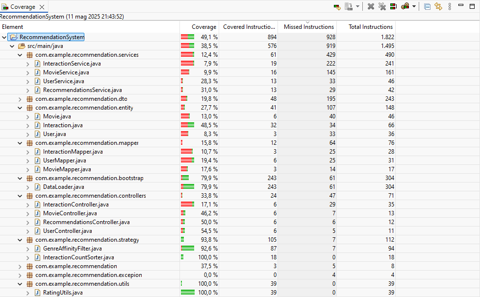
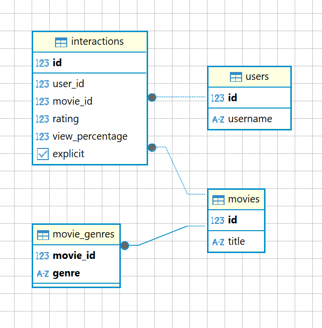

# 🎬 Recommendation System
> A genre-based movie recommender built with Java & Spring Boot

A Java-based RESTful service simulating a **recommendation engine for video content**, built with Spring Boot.
It manages a catalogue of movies and user interactions - such as **ratings** and **views** - and provides **genre-aware** movie recommendations.


## 📚 Table of Contents

- [📌 Objective](#objective)
- [🛠️ Built With](#built-with)
- [🛠️ Functional Requirements](#functional-requirements)
- [🚀 Features](#features)
- [📖 API Specification](#api-specification)
- [🗂️ Project Structure](#project-structure)
- [📥 Provided Data Files](#provided-data-files)
- [🐳 Docker, Containerization & Deployment](#docker-containerization-deployment)
- [▶️ Getting Started](#getting-started)
- [📊 API Testing](#api-testing)
- [🧪 Testing Strategy & Coverage](#testing-strategy-coverage)
- [🧩 DB Schema: Design Choices](#db-schema-design-choices)
- [⚙️ RESTful API Considerations](#restful-api-considerations)
- [⚡ Native Query Performance](#native-query-performance)
- [📄 License](#license)
- [🙋‍♂️ Author](#author)

## 🎯 Objective

The service is designed to:
* Manage a catalogue of movies;
* Track and manage user interactions;
* Recommend movies.

### Interaction/Event Types

**Rating**: Integer rating from 1 (dislike) to 5 (like)

**View**: A view percentage from 0% to 100%  
  ⤷ Converted into **implicit ratings** as:
  * 60–80% → Rating 4,
  * >80% → Rating 5

**Note**: Explicit ratings override implicit ones.


## 🛠️ Built With

* Java 21
* Spring Boot 3.4.5
* JPA
* H2 (testing) / PostgreSQL (production-ready)
* JUnit
* Maven
* Docker


## 🛠️ Functional Requirements

### 1. Retrieve a list of all movies

Retrieve a list of all movies with the possibility to specify optional query parameters:
* <b>genre</b>: filter movies by genre;
* <b>minRating</b>: filter movies with an average rating above a certain value;
* <b>maxRating</b>: filter movies with an average rating below a certain value;

### 2. Retrieve a user's interaction history
Retrieve a user's interaction history. The API has to provide an optional query
parameter to retrieve ratings only, views only or both.

### 3. Add an event for a movie by the user
Ingest a new event (rating or view) for a movie by updating the user's
interaction history in the database and adjusting recommendation results
accordingly.

### 4. Recommend movies for a user
Retrieve a list of recommended movies similar to those that the user has
rated highly (e.g. 4 and 5) and hasn't rated yet. For sake of simplicity,
similarity between movies has to be computed on “Genre” metadata only.
Optionally, prioritize movies with the higher number of events.


## 🚀 Features

✅ Add or update interactions via `PUT /interactions`.
✅ Get personalized movie recommendations via `GET /recommendations/{userId}`.
✅ Uses genre affinity & interaction count sorting strategies.
✅ Built-in Swagger documentation.
✅ Prepopulated database using CSV files.
✅ Dockerized setup with PostgreSQL and PgAdmin.


## 🗂️ Project Structure

```bash
├── dto/
│   ├── InteractionDto.java
│   ├── InteractionRequestDto.java
│   ├── MovieDto.java
│   └── UserDto.java
├── mapper/
│   ├── InteractionMapper.java
│   ├── MovieMapper.java
│   └── UserMapper.java
├── entity/
│   ├── Interaction.java
│   ├── Movie.java
│   └── User.java
├── repository/
│   ├── MovieRepository.java
│   ├── UserRepository.java
│   └── InteractionRepository.java
├── service/
│   ├── InteractionService.java
│   ├── MovieService.java
│   ├── RecommendationsService.java
│   └── UserService.java
├── controllers/
│   ├── InteractionController.java
│   ├── MovieController.java
│   ├── RecommendationsController.java
│   └── UserController.java
├── strategy/
│   ├── GenreAffinityFilter.java
│   ├── InteractionCountSorter.java
│   ├── MovieSimilarityFilterStrategy.java
│   └── MovieSorterStrategy.java
├── bootstrap/
│   └── DataLoader.java
├── utils/
│   └── RatingUtils.java
├── test/
│	 ├── repository/
│	 │   └── MovieRepositoryTest.java
│	 ├── utils/
│	 │   └── RatingUtilsTest.java
│	 └── strategy/
│		  ├── GenreAffinityFilter.java
│		  └── InteractionCountSorter.java
│
├── init.sql
├── Dockerfile
└── docker-compose.yml
```

## 📖 API Specification

This project provides a fully documented, self-describing RESTful API, allowing developers and stakeholders to explore and understand the system's capabilities **without digging into the source code**.

### 🔍 Swagger UI

A live, interactive **Swagger UI** is included out of the box. It offers:

- 🧭 **Clear endpoint documentation**;
- 🧪 **Request/response examples**;
- ✅ **Try-it-out functionality** for quick manual testing.

Once the app is running, access the UI at:

👉 [http://localhost:8080/swagger-ui/index.html](http://localhost:8080/swagger-ui/index.html)

### 🔧 APIs

`GET`       | `/api/v1/movies`                                     | List all movies with optional filters (`genre`, `minRating`, `maxRating`)

`GET`       | `/api/v1/interactions/{userId}/history`       | Retrieve a user's interaction history

`PUT`       | `/api/v1/interactions/addevent`                 | Add an event (rating or view) for a movie by the user

`GET`       | `/api/v1/recommendations/{userId}`             | Get movie recommendations for a specific user


Each endpoint is fully documented in Swagger, including:
- Query parameters;
- Request bodies;
- Example payloads;
- Response formats and HTTP status codes.

> 🔄 Swagger is auto-generated from the code using SpringDoc.


## 📥 Provided Data Files

The application uses CSV files to **prepopulate the database** on startup:

- `users.csv` contains user information.
- `movies.csv` contains movie information.
- `ratings.csv` contains user ratings for movies.

These files are loaded automatically by the `DataLoader` class at application startup to ensure immediate usability.

> ✅ No manual data entry required.  
> 📁 Files located in `src/main/resources/data/`


## 🐳 Docker, Containerization & Deployment

This project comes with full Docker support, allowing you to spin up the entire environment—including the application, a PostgreSQL database, and a visual database inspector—without manual setup.

The system includes a `Dockerfile` and `docker-compose.yml` for easy deployment.

### 🧩 docker-compose.yml

Architecture (via docker-compose.yml):

```bash
services:
  db:
    image: postgres:15
    container_name: recommendation_db
    environment:
      POSTGRES_USER: postgres
      POSTGRES_PASSWORD: postgres
      POSTGRES_DB: recommendation
    ports:
      - "5432:5432"
    volumes:
      - ./init.sql:/docker-entrypoint-initdb.d/init.sql
    healthcheck:
      test: ["CMD", "pg_isready", "-U", "postgres"]
      interval: 10s
      timeout: 5s
      retries: 5

  app:
    build: .
    container_name: recommendation_app
    depends_on:
      db:
        condition: service_healthy
    ports:
      - "8080:8080"
    environment:
      SPRING_PROFILES_ACTIVE: prod
      SPRING_DATASOURCE_URL: jdbc:postgresql://db:5432/recommendation
      SPRING_DATASOURCE_USERNAME: postgres
      SPRING_DATASOURCE_PASSWORD: postgres

  pgadmin:
    image: dpage/pgadmin4
    container_name: pgadmin
    environment:
      PGADMIN_DEFAULT_EMAIL: admin@demo.com
      PGADMIN_DEFAULT_PASSWORD: admin
    ports:
      - "5050:80"
    depends_on:
      - db
```

The docker-compose.yml orchestrates three key services:

DB – PostgreSQL Database
* Uses postgres:15
* Loads schema from init.sql;
* Exposes port 5432;
* Includes a healthcheck to ensure it's ready before the app starts

Spring Boot App - Recommendation Service
* Built from the Dockerfile;
* Connects to the internal PostgreSQL instance;
* Runs under the prod Spring profile;
* Exposes API on port 8080.

PgAdmin – Visual Database Interface
* Exposes a web interface on port 5050 to inspect the database visually.

### Dockerfile

```dockerfile
FROM eclipse-temurin:21-jdk-alpine
WORKDIR /app
COPY target/RecommendationSystem-0.0.1-SNAPSHOT.jar app.jar
EXPOSE 8080
ENTRYPOINT ["java", "-jar", "app.jar"]
```
### 🔄 Database Initialization with `init.sql`

The `init.sql` file is automatically mounted into the PostgreSQL container via the volume mapping defined in `docker-compose.yml`:

```yaml
volumes:
  - ./init.sql:/docker-entrypoint-initdb.d/init.sql
```

## ▶️ Getting Started

### 🛠 Prerequisites

Before running the application, ensure you have Docker (v20+ recommended) installed on your machine .

### Run

Build the app (if not already built)

```bash
./mvnw clean package
```

Start the stack

```bash
docker-compose up --build
```

Once services are up:
* Access Swagger UI: [http://localhost:8080/swagger-ui/index.html](http://localhost:8080/swagger-ui/index.html).
* Access PgAdmin.

#### 🔌 Connecting to PgAdmin

Go to [http://localhost:5050](http://localhost:5050)

Login: admin@demo.com / admin

Create a new server with:
* Host: db
* Port: 5432
* Username: postgres
* Password: postgres

Done! You can now explore the PostgreSQL schema. This enables full visual access to all tables and relationships in the system.


## 📊 API Testing

You can interact with the REST API via:

* Swagger UI: [http://localhost:8080/swagger-ui/index.html](http://localhost:8080/swagger-ui/index.html).
* Postman (import collection from /postman/Recommendation System.postman_collection.json)
* cURL

### 🔍 Swagger UI

The application includes built-in **Swagger UI** for exploring and testing REST endpoints with ease.

#### 🔧 Features of Swagger UI

- ✅ Browse all available REST endpoints grouped by controller
- ✅ View detailed request/response schema and example payloads
- ✅ Trigger API requests directly from the browser
- ✅ Supports automatic schema generation based on DTOs

### 🛠️ Use Cases

Swagger UI is ideal for:
- Quickly testing new API features during development
- Validating request payloads without external tools
- Demonstrating functionality to reviewers or stakeholders

> If you're using Docker, Swagger will be available as soon as the `app` service is up.


## 🧪 Testing Strategy & Coverage

A bottom-up testing strategy was adopted:

✅ Starting from the most critical and atomic components.

✅ Covering business logic and recommendation strategies.

✅ Verified API endpoints via E2E testing.

I deliberately excluded unit tests for DTOs, mappers, and entities, as they are indirectly tested through integration and strategy tests.  Dedicated unit tests were deemed unnecessary.

### Test Database
* Uses embedded H2 in-memory database;
* Schema built via SQL: test/schema.sql;
* Data loaded via SQL: test/import.sql.

This approach guarantees:
* Fast and repeatable tests.
* Zero side-effects on the actual PostgreSQL database.
* Easy schema and data setup via SQL.

### ✅ Code Coverage

To validate the effectiveness of the tests, code coverage was measured using [EclEmma (JaCoCo)](https://www.eclemma.org/). The following snapshot shows the current test coverage across packages:



A high coverage rate was achieved, confirming the effectiveness of the bottom-up test approach.

The current focus has been on covering the most significant logic (strategies, mappers, utils, and repository methods). Additional test cases will extend coverage further in future iterations.

### 🧪 Testing Highlights

* <b>RatingUtilsTest.java</b>: Confirms correct conversion from view percentages to implicit ratings..
* <b>MovieRepositoryTest.java</b>: Tests native SQL query to retrieve movie recommendations.
* <b>GenreAffinityFilterTest.java</b>: Validates the Genre Affinity Filter strategy for recommending movies based on users’ high-rated genres.
* <b>InteractionCountSorterTest.java</b>: Validates the sort strategy to ensure correct ordering by interaction count.


## 🧩 DB Schema: Design Choices

The database schema was deliberately kept simple yet expressive, closely mirroring the domain model. This allows for a natural mapping between Java entities and relational tables, minimizing boilerplate and avoiding overengineering.

### ✨ Key Design Highlights

Each concept in the system - User, Movie, Interaction, Genre - is represented as a distinct table. This ensures data consistency and avoids redundancy.

* **Users**: stores application users, identified by a unique ID and a username.
* **Movies**: stores movies, each with a unique ID and title.
* **Interactions**: core junction table capturing both ratings and view percentages between users and movies. Supports both explicit and implicit feedback.
* **movie_genres**: associates movies to multiple genres using a simple key-value structure (movie_id, genre). This design avoids the need for a fixed genre enum and allows flexibility.

### 🔗 Relationships
One-to-Many:
* One user can have many interactions.
* One movie can be associated with many interactions.
* One movie can have multiple genres via movie_genres.

Composite Logic in Interactions:
* The interactions table combines rating, view_percentage, and explicit flags in a unified format. This approach avoids splitting interactions into multiple tables or types.
* Ratings are either user-provided (explicit=true) or inferred from viewing behaviour (explicit=false).

### ⚡ Designed for Scalability

The movie_genres table enables multi-genre assignment without altering the schema, making it easy to add new genres dynamically.

Interaction data is modeled in a way that can grow significantly with user behavior tracking—without affecting performance or introducing denormalized structures.

### 🧠 Conclusion

✅ Clean, flexible, and expressive.

✅ Domain-aligned with no impedance mismatch.

✅ Easily extendable for future metadata like release year, actors, or content type.

This design was chosen to strike a balance between simplicity, maintainability, and scalability, perfectly serving the functional and performance needs of the recommendation system.



## ⚙️ RESTful API Considerations

### Use of HTTP PUT for Insert or Update

In RESTful architecture, `PUT` is the preferred method for **idempotent** operation - where multiple identical requests result in the same outcome. This design principle has been carefully adopted in this project for managing **user interactions** with movies.

#### Where it's applied:

- **Endpoint:** `PUT /api/v1/interactions/addevent`

This endpoint is used to create or update an interaction. Specifically:

- If an interaction (i.e., a user-movie pair) already exists, it is **updated** with the new rating or view percentage.
- If it does **not exist**, a new interaction is **inserted**.

This upsert behavior ensures:
- Clients don't need to check for the existence of an interaction before sending data.
- Reduces complexity on the client side.
- Maintains RESTful principles by allowing safe retries without side effects.

#### Why this choice?

- ✅ **Idempotency**: Guarantees consistency regardless of repeated requests.
- ✅ **Simplicity**: Reduces need for multiple endpoints (`POST` + `PATCH`) and conditional logic.
- ✅ **Clarity**: Aligns with expected behavior in scenarios where user interaction evolves over time (e.g., rating updated after a second viewing).


## ⚡ Native Query Performance

A custom native query is used in MovieRepository to fetch recommendations efficiently.
This query selects movies not yet rated by the user, with an average rating >= 4,
and matches the user’s preferred genres. It also counts the total number of interactions to support prioritization.

```bash
@Query(value = """
			SELECT m.id, m.title, COUNT(*) AS interactions_count
			FROM movies m
			JOIN interactions i
			ON i.movie_id = m.id
			WHERE m.id NOT IN (
				SELECT movie_id
				FROM interactions
				WHERE user_id = :userId
				AND rating IS NOT NULL
			)
			AND (
				SELECT AVG(rating)
				FROM interactions
				WHERE movie_id = m.id
				AND rating IS NOT NULL
			) >= 4
			AND m.id in (
				select g.movie_id
				from movie_genres g
				where g.genre IN (:preferredGenres)
				GROUP by g.movie_id
			)
			GROUP BY m.id, m.title
			""", nativeQuery = true)
```

Why Native Query?

✅ Better performance with large datasets.
✅ Avoids and reduce JVM memory overuse.
✅ Avoids expensive entity graph loading.


## 📄 License

This project is provided for evaluation and educational purposes.
Feel free to copy ;).

## 🙋‍♂️ Author

Developed by Giulio Imperato as part of a technical challenge.  
For inquiries or feedback, feel free to reach out via GitHub or email at imperatogiulio@tutanota.com.
# Recommendation-System

